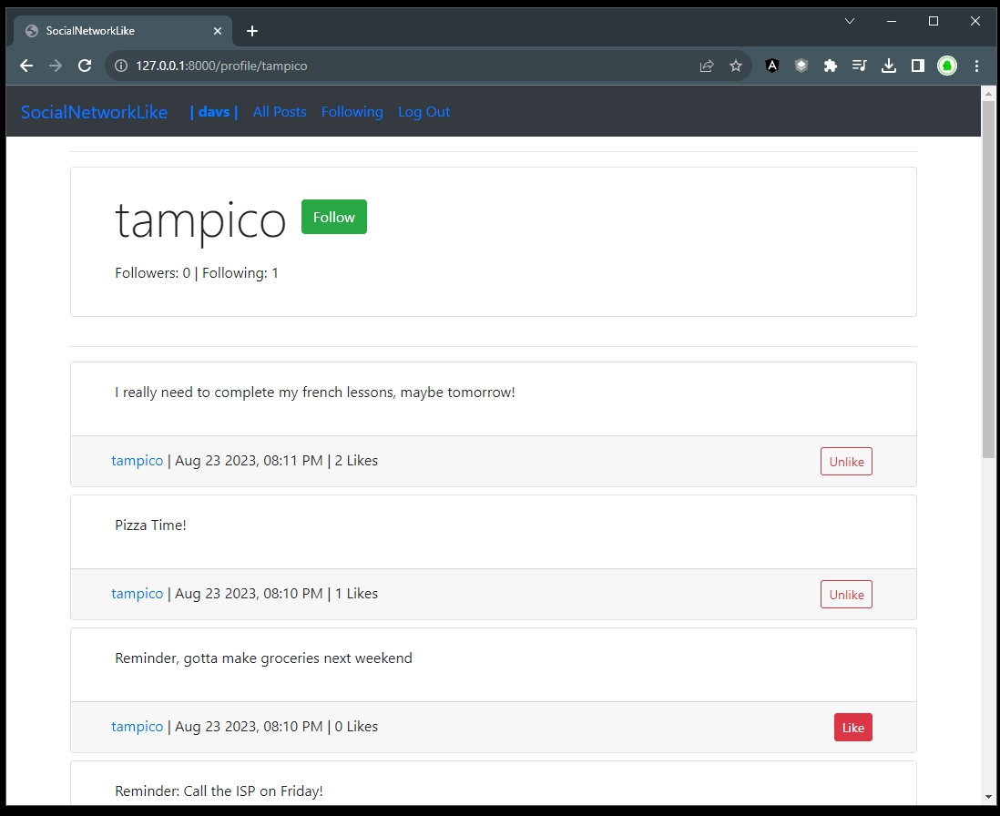

# General notes

## Description

- Social Network features application

### Features

- Allows to publicly create post 
- Allows to Edit post previously created
- Allows to Login
- Allows to Logout
- Allows to follow by others
- Allows to being followed
- Allows to like posts
- Allows to be installed locally (local database)
- Allows to be installed with decentralized database
- Display posts paginated
- Display posts with Date, numbers of likes
- Updates number of likes without postback
- Allows to filter posts from all users
- Allows to filter posts from followed users

### Pending improvements

- Create Reusable components 
- Create a packed Front-End
- Re-write the vanilla logic into only React

## Demo

- [https://www.youtube.com/watch?v=VGS4gupJmFA](https://www.youtube.com/watch?v=VGS4gupJmFA)

## Interface

- 
- 
- 

## Installation

- In your terminal, `cd` into the SocialNetworkLike directory.
- Run `python manage.py makemigrations network` to make migrations for the network app.
- Run `python manage.py migrate` to apply migrations to your database.

## Endpoints

- GET `/profile`
    - input: `userid` `<int>`
    - returns the `User` information
        - username
    - returns the `Post` information, related to the actual logged `User`
        - authorpost
        - textpost
        - timepost'
        - Ability to `Edit` the post
    - returns `Like` information, related to the each post
        - if the post has been liked or not
    - returns `Follower` information
        - number of followes
        - number of users following

- GET `/post`
    - input: 
    - returns the `Post` information, related to everyone
        - authorpost
        - textpost
        - timepost'
        - Ability to `Edit` the post
        - Like Ability

    - returns the `Post` information related to only following users
        - authorpost
        - textpost
        - timepost'
        - No Edit
        - Like Ability

- POST `/post`
    - input
        - textcontent
        - userid

## References:

- Entity Relation Model Diagram [https://app.diagrams.net/?libs=general;er#Dp4Network](https://app.diagrams.net/?libs=general;er#Dp4Network)